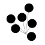

gadfly
======

This is the documentation for ``gadfly``, a Python package for generating photometry of
stars with granulation and p-mode oscillations. The source code is available
`on GitHub <https://github.com/bmorris3/gadfly>`_.

.. warning:: A major API overhaul is underway. Prepare for big changes!

.. toctree::
   :maxdepth: 2
   :caption: Contents:

   gadfly/install.rst
   gadfly/start.rst
   gadfly/validation.rst
   gadfly/reference.rst

Indices and tables
==================

* :ref:`genindex`
* :ref:`modindex`
* :ref:`search`
